# Technical Implementation Plan - NeonHop 3D Cyber-Arcade Game

Build a high-fidelity, visually spectacular NeonHop 3D cyber-arcade game set in a Cyberpunk / Cyber-Neon digital universe using WebGL (Three.js r160+) for isometric 3D rendering, a procedural lane spawning engine, dynamic Web Audio synthesis, and glassmorphism HUD overlays.

---

## Architectural Goal & Philosophy
We will structure the project into clean, decoupled modules using ES6 Modules with an **Import Map** loading Three.js directly as a module. We will enforce:
1. **Deterministic Fixed-Timestep Loop** with temporal state interpolation ($\alpha$) to prevent micro-stutter.
2. **Zero-Allocation Game Loop** to avoid Garbage Collection (GC) pauses.
3. **Instanced Rendering** for obstacles to minimize draw calls.
4. **Billboard Glowing Reflections** to simulate dynamic lights at zero lighting shader cost.

---

## Phased Development Roadmap

We will implement this workspace sequentially across **6 distinct phases** to maintain clear milestones, isolate debugging layers, and verify performance increment-by-increment.

```mermaid
gantt
    title NeonHop 3D Phased Roadmap
    dateFormat  X
    axisFormat %d
    section Phase 1
    Foundations & HTML/CSS Scaffolding  :active, p1, 0, 2
    section Phase 2
    Deterministic 60Hz Physics & Loop :active, p2, after p1, 3d
    section Phase 3
    3D WebGL Instanced Rendering       :active, p3, after p2, 4d
    section Phase 4
    Voice-Pooled Web Audio Synth      :active, p4, after p3, 3d
    section Phase 5
    Hybrid Controls & Leaderboard     :active, p5, after p4, 3d
    section Phase 6
    Polishing & Multi-Device QA        :active, p6, after p5, 2d
```



---

### Phase 1: Foundations, CSS & Core Scaffolding
Establish the responsive HTML canvas container, modern glassmorphism panels, and core dependency management.

*   #### [index.html](../index.html) (Completed)
    *   **Structure**: Responsive UI split between side HUD (score, lives, level count, volume controls) and central WebGL canvas stage.
    *   **Import Maps**: Load Three.js r160 directly from a reliable CDN:
    ```html
    <script type="importmap">
      {
        "imports": {
          "three": "https://unpkg.com/three@0.160.0/build/three.module.js"
        }
      }
    </script>
    ```
    *   **Overlay systems**: Screens for `READY`, `PAUSED`, and `GAME OVER` with blurred background backdrops.

*   #### [styles.css](../styles.css) (Completed)
    *   **Aesthetic**: Vibrant dark-mode palette using HSL variables (neon pink, cyan, green).
    *   **Compositing Guard**: Enforce `backdrop-filter: blur(12px)` **only on desktop** (widths $\ge 1024\text{px}$) to prevent mobile GPU thermal throttling, falling back to clean semi-transparent layers.

*   #### [local_model_log.md](./local_model_log.md) (Completed)
    *   Establish local query logger to comply with **Rule 1 (Absolute Local-Model Inference Rules)**.

---

### Phase 2: Core Game Loop & State Interpolation
Establish the time-accumulator fixed-timestep engine, state-machine transitions, and the basic player position mapping.

*   #### [main.js](../src/main.js) (Completed)
    *   Bootstrapper to initialize the UI, wire modules, handle keyboard/virtual D-Pad triggers, and coordinate the state machine lifecycle.

*   #### [gameEngine.js](../src/gameEngine.js) (Completed)
    *   **Physics Core**: Deterministic ticks locked at exactly $60\text{ Hz}$ ($16.67\text{ ms}$).
    *   **Stutter Elimination**: Compares standard elapsed times against the physics timer, storing `prevPosition` and `currPosition` values for all moving entities, and computes the fractional remainder:
    $$\alpha = \frac{\text{accumulator}}{\text{fixedDeltaTime}}$$
    *   **Zero-Allocation**: Pre-allocates player coordinate objects in memory to eliminate Garbage Collection sweeps.
    *   **13-Row Grid Setup**: Starts safe-zone, 5 road lanes (with vehicles moving at speed metrics scaled by level), 1 mid-river safety junction rest bank, 5 river stream lanes (data packet logs moving at distinct rates), and 5 top destination portal slots.
    *   **$O(1)$ Occupancy Collisions**: Developed fast grid cell checks for road vehicle crashes, river dead-zone falls, and targeted destination slot captures.

---

### Phase 3: 3D WebGL Renderer & High-Performance Instanced Spawning
Build the WebGL isometric perspective viewport, procedurally generated 3D models, and optimized draw-call instancing.

*   #### [renderer.js](../src/renderer.js) (Completed)
    *   **WebGL Viewport**: Creates Three.js Scene, isometric perspective Camera, and dynamic viewport resize listeners.
    *   **Instancing Manager**: Implements `THREE.InstancedMesh` for road cars, logs, and obstacles, compressing hundreds of active models into a single draw call.
    *   **Dynamic Light Simulation (GPU Guard)**: Instead of high-overhead dynamic Point Lights, uses flat emissive textures/materials and additive 2D glowing quad billboards floating slightly above the floor grid ($Y = 0.01$) to simulate vehicle reflection sweeps.
    *   **Visual Assets**: Procedurally shapes the player (neon green capsule with animated squash-and-stretch on hops), cyber-cars, glass binary data streams (logs), and glowing grid floors.

---

### Phase 4: Voice-Pooled Web Audio Synth & Scheduler
Programmatically synthesize immersive sound effects and tempo-locked music without loading external audio assets.

*   #### [soundEngine.js](../src/soundEngine.js) (Completed)
    *   **Voice Pooling**: Pre-allocates a fixed pool of connected synth voices (Oscillator, Gain, Filter nodes) to prevent GC pauses during hot gameplay triggers (jumps, laser impacts).
    *   **Look-Ahead Scheduler (Two-Clocks)**: Utilizes a high-frequency low-overhead JavaScript timer to schedule note steps $100\text{ ms}$ ahead using high-precision hardware clocks. This prevents background music drift or pops when WebGL frames load.
    *   **User Activation**: Context initialization is deferred until user click inputs occur to comply with browser autoplay security.

---

### Phase 5: Hybrid Controls & Leaderboard System
Wire unified swipe and keyboard input structures and local high score serialization.

*   #### [inputManager.js](../src/inputManager.js) (Completed)
    *   **Unified Buffer**: Queues successive keystrokes (WASD / Arrows) to prevent input drops.
    *   **Mobile Swipes**: Compares `touchstart` and `touchend` offsets to parse swipes, overriding default browser navigation bounce using `preventDefault()`.
    *   **Virtual Controller**: Binds screen touch buttons to direction commands.

*   #### [leaderboard.js](../src/leaderboard.js) (Completed)
    *   Saves top 5 scores dynamically to local storage, featuring schema version checks to handle data migration.

---

### Phase 6: Polish, Integration & Visual Auditing (Completed)
Conclude development with visual performance checks and responsive viewport tuning.

*   **Audit Checks**:
    1. Confirm WebGL frame rate sustains steady $60\text{ FPS}$ under maximum lane sprawl.
    2. Confirm memory utilization stays flat (zero memory leaks or GC frame-drops).
    3. Verify audio context suspends/resumes correctly on window blur/focus.

---

## Verification Plan

### 🧪 Automated Verification
1. **Source Syntax Audit**: Parse and check all Javascript files for standard syntax compatibility.
2. **Three.js Scope Verification**: Ensure no syntax errors when rendering elements or configuring materials.

### 🎮 Manual Visual & Audio Auditing
1. Deploy index.html on local loopback server or load in browser.
2. Test responsive resizing: verify that the 3D Canvas resizes correctly and keeps standard aspect ratio in landscape and portrait.
3. Verify keyboard inputs and inspect swipe tracking in Chrome console logs.
4. Auditing Web Audio Synth: Ensure no clipping or latency during polyphonic overlaps (music arpeggios + hop sound effects).
