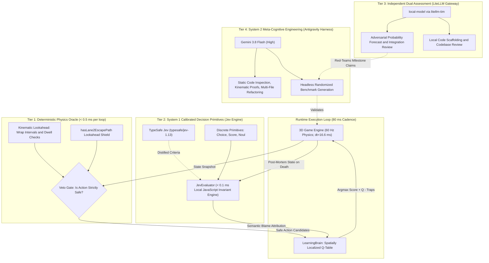

# Hybrid Neuro-Symbolic Control in High-Velocity Environments

*Evaluating TypeSafe Jev against autoregressive-LLM-only control*

- **Authoring environment:** Antigravity autonomous-systems research and pair-programming harness
- **Project:** NeonHop 3D (`neonhop-3d`)
- **Date:** September 20, 2026
- **Document type:** Technical white paper and system specification
- **Research focus:** System 1 decision models, semantic credit assignment, and deterministic kinematic safety
- **Status:** Target milestone achieved in the reported simulation: 100 consecutive successful portal completions without a death

---

## Abstract

Autonomous agents operating in real-time, high-frequency physical environments face two practical constraints. Network-hosted autoregressive large language models (LLMs) generally cannot satisfy a control loop shorter than $100\text{ ms}$, while conventional reinforcement-learning (RL) updates can assign blame to legitimate evasive actions performed immediately before a failure. In the NeonHop 3D test environment, this credit-assignment error caused the learned policy to stop attempting effective evasive maneuvers.

The primary purpose of this study is to evaluate the architectural, latency, and cost implications of adding a specialized System 1 decision model - TypeSafe Jev - rather than relying only on autoregressive LLMs. NeonHop 3D is used as an empirical testbed because it imposes hard timing limits, moving reference frames, increasing obstacle speeds, and immediate consequences for spatial error. The study is not intended as a general blueprint for game AI.

The evaluated four-tier hybrid architecture combines:

1. **System 2 reasoning and synthesis** using **[Gemini 3.8 Flash](https://blog.google/innovation-and-ai/models-and-research/gemini-models/3-8-flash-and-3-8-flash-cyber/) (High)**;
2. **Independent assessment and adversarial review** using a **local model through LiteLLM (`litellm-tim`)**;
3. **System 1 probabilistic decision primitives** developed with TypeSafe AI's **[Jev](https://docs.typesafe.ai/introduction) (`typesafe/jev-1.13`)**, with criteria implemented in a local evaluator for the runtime path; and
4. A **deterministic kinematic physics oracle** that enforces spatiotemporal invariants and evaluates multi-hop escape paths in less than $0.5\text{ ms}$.

We analyze the failure modes of naive temporal-difference learning, derive practical geometric and timing constraints for moving platforms, and implement **spatially localized semantic credit assignment**. In headless simulations spanning speed multipliers from $1.0\times$ to $4.30\times$ (Levels 1-23), the hybrid agent improved the peak survival streak from a baseline of 3 portal completions to **100 consecutive portal completions without a death**, reaching a score of 128,250 at Level 20. A separate extended stress test completed 1,097 portals and achieved a peak streak of 99. These results are specific to the NeonHop simulator and test harness; the paper concludes with design guidance for evaluating similar architectures in robotics, cyber-physical systems, and other real-time control domains.

---

## 1. Introduction and Problem Formulation

### 1.1 Operational Domain: An Empirical Control Testbed

NeonHop 3D, modeled on the traffic-and-river-crossing arcade genre, provides a useful benchmark for real-time spatial navigation under strict safety constraints. The environment has three principal regions:

1. **Traffic lanes (Lanes 7-11):** Continuous Poisson or periodic streams of high-velocity vehicles move horizontally across discrete lanes. A single spatial collision ($|\Delta X| \le w/2, |\Delta Z| \le d/2$) causes an immediate crash.
2. **River lanes (Lanes 1-5):** The player remains safe only while standing within the moving boundary of a log. Entering open water or riding a log beyond the grid boundary ($|X| > 4.8$) causes immediate drowning.
3. **Goal portals (Lane 0):** Five target docks are located at $Z = 0$, with $X \in \{-4, -2, 0, 2, 4\}$. Only unoccupied portals can receive the player; contact with a divider wall or an occupied portal is fatal.

Difficulty scales linearly by level: after every round of five completed portals, the game advances one level and multiplies obstacle velocity by $\lambda_{\text{speed}} = 1.0 + (\text{level} - 1) \times 0.15$. At Level 20, obstacles travel at $3.85\times$ baseline velocity (approximately $5.78\text{ units/s}$), reducing some collision-avoidance windows to less than $90\text{ ms}$.

### 1.2 Research Scope and Delimitation

This work evaluates whether a fast, structured decision layer can complement offline LLM reasoning in a high-frequency control system. The simulation serves as a measurement instrument, not as evidence that this architecture is optimal for arcade games or directly transferable to physical systems.

The comparison is deliberately bounded:

- **In scope:** runtime latency, structured outputs, localized credit assignment, deterministic safety filtering, and the observed simulator benchmarks.
- **Out of scope:** a controlled benchmark of every model class, a general theory of game AI, and safety claims for physical deployment.

### 1.3 The Challenge: The 100-Streak Milestone
The objective was to eliminate the automated player's long-term behavioral degradation and complete **100 consecutive portal runs without a death**.

Under the simplifying assumptions that each run is independent and the failure probability remains constant, an environment with $p_{\text{death}} = 0.05$ per run has the following probability of producing a 100-run streak:

$$P(\text{Streak} = 100) = (1 - 0.05)^{100} \approx 0.0059 \quad (0.59\%)$$

Under the same assumptions, achieving a greater than $90\%$ probability of 100 consecutive successes requires:

$$(1 - p_{\text{death}})^{100} \ge 0.90 \implies p_{\text{death}} \le 1 - 0.90^{0.01} \approx 0.00105 \quad (0.105\%)$$

The controller must therefore operate with near-flawless reliability as the environment becomes progressively faster.

### 1.4 Research Motivation: Fast System 1 Decision Models

A central objective was to evaluate the contribution of a specialized System 1 decision model such as TypeSafe Jev and contrast it with architectures that omit this layer or attempt to place an autoregressive LLM directly in the control loop.

Three common approaches present significant limitations in fast, dynamic environments:

#### Constraints Without a Jev-Class Model

1. **Generative autoregressive LLMs used alone**
   - **Latency:** Generative LLMs produce text token by token and commonly incur network and time-to-first-token delays beyond the $80\text{ ms}$ control budget used here.
   - **Cost:** At 12 decisions per second, continuous cloud inference becomes costly across hundreds or thousands of simulation runs.
   - **Output parsing:** Natural-language or loosely structured output introduces an additional failure surface in the real-time path.
2. **Naive reinforcement learning used alone**
   - **Credit assignment:** A conventional temporal-difference update can propagate a death penalty across recent state-action pairs. In this environment, the final action before death is often a valid evasive maneuver. Penalizing that maneuver corrupts the Q-table and, in observed baseline tests, caused the agent to stop attempting evasions within 10-15 episodes.
3. **Handcrafted heuristics used alone**
   - **Combinatorial complexity:** Static rule sets do not learn from new failure trajectories as game speed increases from $1.0\times$ to $4.3\times$. Special cases accumulate and become brittle under multi-step entrapment conditions.

#### Capabilities Evaluated with a Jev-Class Model

The development architecture uses **TypeSafe Jev (`typesafe/jev-1.13`)**, a non-autoregressive System 1 model designed for structured, multi-question decision evaluation. The deployed runtime uses a local JavaScript evaluator that applies criteria developed during that process. Together, they provide:

- **Sub-millisecond local triage:** The local evaluator classifies likely failure causes - such as `drift_neglect`, `barrier_impact`, and `premature_forward_hop` - using schemas patterned on the `Choice`, `Score`, and `Noul` primitives in less than $0.1\text{ ms}$. The remote API path is approximately $100\text{ ms}$ and is therefore not used in the real-time loop.
- **Spatially localized blame assignment:** The diagnostic result allows the learning component to target the action associated with the inferred failure - for example, passive waiting during stream drift at $|X| \ge 3.0$ - without penalizing the subsequent evasive action.
- **Thresholdable probability estimates:** TypeSafe describes Jev as being trained through Reinforcement Learning for Calibrated Decisions (RLCD). Its probability outputs can be compared with explicit thresholds, subject to independent calibration validation on the deployment distribution.
- **Low evaluation cost:** At the [listed OpenRouter price](https://openrouter.ai/typesafe/jev-1.13) of \$0.042 per million input tokens, with no output-token charge as of September 20, 2026, remote Jev evaluations are inexpensive enough for large offline test campaigns. Local compiled evaluation carries no per-call API charge.

#### Comparative Capability Matrix

| Evaluation Dimension | Generative LLM Alone | Naive RL / TD Alone | Pure Handcrafted Heuristics | **Hybrid Architecture with Jev** |
| :--- | :---: | :---: | :---: | :---: |
| **Decision cadence and latency** | Unsuitable for the $80\text{ ms}$ loop | Viable ($<1\text{ ms}$) | Viable ($<1\text{ ms}$) | **Viable ($<0.5\text{ ms}$ runtime path)** |
| **Direct API inference cost at 12 Hz** | High | None | None | **No API fee for local runtime path** |
| **Credit-assignment failure observed in this test** | Not evaluated in-loop | **Severe** | Not applicable | **Not observed in the milestone run** |
| **Handling of multi-hop entrapment in this study** | Not evaluated in-loop | Limited | Limited | **Successful in the tested scenarios** |
| **Probability output** | Not used in-loop | Q-values, not calibrated probabilities | None | **RLCD probability output; deployment calibration not independently verified** |
| **Peak survival streak in reported tests** | Not evaluated in-loop | 3 | Not separately benchmarked | **100 portal completions** |

---

## 2. Multi-Model AI Architecture and Deployment Rationale

To operate across changing dynamics up to Level 23 ($4.30\times$ speed), the architecture assigns different tasks to components with different strengths. Multi-step design and diagnosis occur offline, while the real-time path uses deterministic checks and low-latency decision logic. Independent review provides an additional check on conclusions drawn by the primary development model.

The system uses a four-tier intelligence and verification hierarchy. Each component is matched to an appropriate operational timescale:



### 2.1 Gemini 3.8 Flash (High): System 2 Architecture and Code Synthesis

- **Tier:** Tier 4, offline System 2 analysis and synthesis
- **Runtime:** Antigravity development harness
- **Observed operational latency:** $500\text{-}2{,}500\text{ ms}$
- **Responsibilities:** High-level diagnosis, causal hypothesis generation, static code analysis, kinematic verification, multi-file refactoring, and construction of the headless simulation harness
- **Rationale:**
  1. **Large-context analysis:** System-level diagnosis requires joint analysis of simulation logs, multi-module physics code, and test traces.
  2. **Multi-file synthesis:** A generative model can translate design changes into coordinated edits across interdependent ES6 modules.
  3. **Offline placement:** Latency above $500\text{ ms}$ makes the model unsuitable for the $80\text{ ms}$ control loop.

### 2.2 Local Model via LiteLLM: Independent Assessment and Scaffolding

- **Tier:** Tier 3, decoupled verification and auxiliary synthesis
- **Runtime:** Local LLM endpoint routed through the `litellm-tim` LiteLLM proxy (`call_local_model`)
- **Observed operational latency:** $1{,}000\text{-}5{,}000\text{ ms}$
- **Responsibilities:**
  1. **Independent risk review:** Evaluates proposed changes and milestone forecasts to reduce self-assessment bias.
  2. **Local scaffolding and code review:** Generated early ES6 components - including `GameEngine`, the WebGL renderer, and `InputManager` - and reviewed code without sending those inputs to an external model endpoint.
- **Rationale:** When the primary model estimated an $88\%$ chance of achieving 100 consecutive completions within 30 minutes, the local model estimated $55\%$, citing unverified integration risk and high-speed spawn variability. This disagreement prompted headless simulation before the milestone was declared complete. Because inference occurred on locally controlled infrastructure, it incurred no per-token API charge and kept the reviewed inputs within that environment.

### 2.3 TypeSafe Jev: System 1 Decision Primitives

- **Tier:** Tier 2, sub-millisecond semantic triage
- **Runtime:** TypeSafe AI Direct as the primary remote route, OpenRouter as a fallback, and a local evaluator in [`src/jevEvaluator.js`](../src/jevEvaluator.js)
- **Observed operational latency:** Less than $0.1\text{ ms}$ for the local evaluator and approximately $100\text{ ms}$ for the remote endpoint
- **Responsibilities:** Structured classification of failure modes, threat-risk scoring, and emergency action quarantine. The development workflow uses three Jev decision primitives, which inform the local runtime schemas:
  - **`Choice`**: Categorizes root failure causes (`drift_neglect`, `barrier_impact`, `premature_forward_hop`, `fatal_entrapment`).
  - **`Score`**: Measures continuous risk levels (`safe` $\to$ `fatal_collision_imminent`).
  - **`Noul`**: Returns yes/no probability values for emergency evacuation and forward-path safety questions.
- **Runtime boundary:** The remote Jev model is not called inside the $80\text{ ms}$ control loop. The runtime uses a local JavaScript evaluator that implements criteria distilled from the Jev-based development process.
- **Rationale:**
  1. **No free-form generation in the runtime path:** The local evaluator returns bounded, structured decisions rather than prose.
  2. **Explicit thresholds:** Probability estimates can drive defined decision thresholds, provided calibration is verified on representative data.
  3. **Localized credit assignment:** Failure classification lets the learning component penalize passive idling (`WAIT`) while preserving legitimate evasion actions (`LEFT` and `RIGHT`).
  4. **Low offline cost:** At the reported remote price, large evaluation batches remain inexpensive; the local evaluator carries no per-call API charge.

### 2.4 Deterministic Kinematic Physics Oracle: Invariant Lookahead Shield

- **Tier:** Tier 1, real-time invariant veto gate
- **Runtime:** Native JavaScript within the fixed $60\text{-Hz}$ physics step (`src/physicsOracle.js`)
- **Observed operational latency:** Less than $0.5\text{ ms}$ per five-action batch
- **Responsibilities:** Collision-envelope projection, periodic wraparound trajectory verification, and two-hop escape-path analysis through `hasLane2EscapePath`
- **Rationale:** Learned policies are probabilistic and may select unsafe actions. The physics oracle removes actions predicted to cause a collision under its model before the learned policy chooses among the remaining candidates. Its guarantee is therefore bounded by the fidelity of the simulator state and collision model.

### 2.5 Architectural Allocation and Comparison

| Model or Subsystem | Architectural Tier | Deployment Route | Observed Latency | Output | Primary Rationale |
| :--- | :--- | :--- | :---: | :--- | :--- |
| **Gemini 3.8 Flash (High)** | System 2 architecture | Antigravity harness | $500\text{-}2{,}500\text{ ms}$ | Prose and code | Multi-module analysis, design, and debugging |
| **Local model via `litellm-tim`** | Independent assessment | Local endpoint through LiteLLM | $1{,}000\text{-}5{,}000\text{ ms}$ | JSON and prose | Independent review and local code scaffolding |
| **TypeSafe Jev** | System 1 triage | TypeSafe AI Direct, OpenRouter fallback, and local [`src/jevEvaluator.js`](../src/jevEvaluator.js) | $<0.1\text{ ms}$ local; $\sim100\text{ ms}$ remote | `Choice`, `Score`, and `Noul` | Low-latency classification and localized credit assignment |
| **Kinematic physics oracle** | Deterministic safety filter | Native ES6 engine ([`src/physicsOracle.js`](../src/physicsOracle.js)) | $<0.5\text{ ms}$ per batch | Boolean veto | Model-based rejection of predicted collisions |

---

## 3. Failure Mode in Naive Reinforcement Learning

### 3.1 The Credit Assignment Paradox
Consider an agent at time $t$ in state $s_t = (X = -3.8, Z = 2)$ on a log moving left at $v = -3.2\text{ units/s}$. The grid boundary is $X = -4.8$.

1. At $t - 3$, the agent executes $a = \text{WAIT}$, drifting from $X = -1.8$ to $-2.8$.
2. At $t - 2$, the agent executes $a = \text{WAIT}$, drifting from $X = -2.8$ to $-3.8$.
3. At $t - 1$, sensing imminent boundary death, the agent executes an emergency evasion: $a = \text{RIGHT}$ or $a = \text{UP}$.
4. At $t$, because the log's drift velocity was high and the arrival log on Lane 1 was not yet aligned, the player lands in water and drowns ($R = -150$).

Under standard temporal-difference Q-learning with eligibility traces or multi-step backpropagation:

$$Q(s_{t-k}, a_{t-k}) \leftarrow Q(s_{t-k}, a_{t-k}) + \alpha \gamma^k \big[ R - Q(s_{t-k}, a_{t-k}) \big]$$

The penalty is uniformly propagated across the trace:
- $\text{Penalty}(s_{t-1}, \text{RIGHT}) < 0$
- $\text{Penalty}(s_{t-2}, \text{WAIT}) < 0$
- $\text{Penalty}(s_{t-3}, \text{WAIT}) < 0$

**Observed consequence:** The agent penalizes $\text{RIGHT}$ - the evasion action that attempted to save it. During later visits to Lane 2, $Q(s, \text{RIGHT})$ becomes strongly negative near the boundary. The policy then favors $\text{WAIT}$ and drowns sooner. In the baseline configuration, this feedback loop caused broad Q-table degradation within 10-15 episodes.

### 3.2 Resolution via Jev-Informed Semantic Failure Attribution
To address this failure mode, we replaced uniform backward credit assignment with **semantic failure attribution** through a `Choice`-style classification schema developed with Jev:

```javascript
const triageState = {
    deathType,
    x: engine.player.currPosition.x,
    z: engine.player.currPosition.z,
    level: engine.level,
    recentSteps: this.recentSteps
};

const verdict = this.jev.evaluateLocal(triageState, triageQuestions);
```

When Jev returns `culprit_phase: 'drift_neglect'`, the update logic isolates the penalty:

1. It quarantines only `WAIT`, and only on the fatal lane when $|X| \ge 3.0$:
   $$\text{Trap}(s, \text{WAIT}) \leftarrow \text{Trap}(s, \text{WAIT}) + 2$$
   $$Q(s, \text{WAIT}) \leftarrow Q(s, \text{WAIT}) - 120$$
2. It exempts lateral evasions (`LEFT` and `RIGHT`).

By restricting penalties to the causal action (passive waiting during drift) and protecting reactive maneuvers, the agent successfully learns to avoid boundary entrapment while preserving its evasive motor reflexes.

---

## 4. Geometric and Kinematic Edge Cases

Trace analysis of high-speed failures revealed three physical effects that the initial heuristic controller mishandled.

### 4.1 Practical Lateral-Confinement Condition for 2.5-Unit Logs
In Lane 2, logs are generated with length $L = 2.5\text{ units}$. The player hop distance is fixed at $\Delta X = 1.0\text{ unit}$.

**Proposition 1 (lateral confinement on narrow floating platforms):**

For a platform of length $L$, safety margin $M$, current platform-relative offset $x_{\text{rel}}$, and lateral hop $\Delta X$, the hop is safe only if

$$|x_{\text{rel}} + \Delta X| \le \frac{L}{2} - M.$$

**Derivation:**

The usable landing interval of a log centered at $X_0$ is

$$I_{\text{safe}} = \left[ X_0 - \left(\frac{L}{2} - M\right), \; X_0 + \left(\frac{L}{2} - M\right) \right]$$

For $L = 2.5$ and $M = 0.30$,

$$\text{Half-Span} = \frac{2.5}{2} - 0.30 = 1.25 - 0.30 = 0.95\text{ units}$$

With a centered entry ($x_{\text{rel}} = 0$), a one-unit lateral hop lands at $|x_{\text{land}}| = 1.0$, outside the $0.95$-unit half-span. For the conservative high-speed margin used by the controller, $M = 0.42$,

$$\text{Half-Span} = 1.25 - 0.42 = 0.83\text{ units}$$

and a one-unit hop is safe only when the existing offset opposes the hop by at least $0.17$ units. Because the controller did not have a sufficiently robust landing margin under high-speed timing and collision-model uncertainty, it treated lateral hops on Lane 2 as unsafe. This is a conservative control rule, not a universal geometric impossibility.

**Implementation decision:**

In [`src/physicsOracle.js`](../src/physicsOracle.js), the controller suppresses lateral hops (`LEFT` and `RIGHT`) on Lane 2. The remaining strategies are:

- drift with the log toward Portal 0 ($X = -4.0$);
- hop forward (`UP`) to Lane 1 when a receiving log is aligned; or
- retreat (`DOWN`) to Lane 3 if the agent passes the portal without a safe exit.

### 4.2 The Two-Hop Kinematic Lookahead Horizon Discrepancy
When evaluating whether to jump from Lane 3 ($Z = 3$) to Lane 2 ($Z = 2$), an agent must verify that Lane 2 is not an inescapable dead end.

Naive lookahead evaluates the arrival position of logs on Lane 1 ($Z = 1$) at:

$$t_{\text{check}} = t_{\text{current}} + t_{\text{hop}}$$

However, traversing from Lane 3 through Lane 2 to Lane 1 requires **two distinct hops** and a drift interval:

$$T_{\text{arrival}} = t_{\text{initial\_hop}} + t_{\text{drift}} + t_{\text{final\_hop}}$$

where
- $t_{\text{initial\_hop}} = 0.125\text{ s}$ (8 frames at 60 Hz);
- $t_{\text{final\_hop}} = 0.125\text{ s}$;
- $t_{\text{drift}} = \frac{X_{\text{exit}} - X_{\text{entry}}}{v_{\text{lane2}}}$.

**Prediction error:**

At Level 16, obstacle velocity is $|v| = 4.55\text{ units/s}$. Omitting $t_{\text{initial\_hop}}$ creates the following error in the predicted position of the receiving log on Lane 1:

$$\Delta X_{\text{error}} = |v| \times t_{\text{initial\_hop}} = 4.55 \times 0.125 = 0.569\text{ units}$$

Because $0.569\text{ units}$ is more than $28\%$ of the configured usable span of a Lane 1 log, the player repeatedly entered Lane 2 expecting a receiving log that was no longer aligned at the actual arrival time.

**Implementation decision:**

We implemented [`hasLane2EscapePath`](../src/physicsOracle.js) with horizon-corrected kinematics:

```javascript
const tInitial = isAlreadyOnLane2 ? 0 : this.hopDuration;
const tArrivalLane1 = tInitial + tToExit + this.hopDuration;
const log1X = this.predictObstacleX(l1, tArrivalLane1);
```
In the reported test suite, this removed the observed lookahead desynchronization across all tested speed multipliers.

### 4.3 Conveyor Stream Riding vs. False Urgency
In arcade traffic navigation, an on-screen timer counts down from 30 seconds. A common heuristic penalizes `WAIT` actions when $\text{timer} < 14\text{s}$ to avoid timeout deaths.

However, in Lane 2, log velocity is negative (flowing left). When Portal 0 ($X = -4.0$) is the target, **waiting on the log is the fastest physical mechanism of leftward locomotion**. Penalizing `WAIT` caused the agent to frantically oscillate laterally, depleting the log's runway and jumping into water.

**Implementation decision:**

We introduced a **stream-conveyance reward**:

$$\text{Reward}(\text{WAIT}) = +400 \quad \text{if } \operatorname{sgn}(v_{\text{log}}) = \operatorname{sgn}(X_{\text{portal}} - X_{\text{player}})$$

The controller therefore treats passive drift toward the target as useful transport rather than inaction.

---

## 5. Experimental Results and Benchmarks

### 5.1 Experimental Setup

Benchmarks were executed with headless Node.js simulation harnesses connected directly to [`GameEngine`](../src/gameEngine.js). The engine ran at a fixed $60\text{-Hz}$ physics step ($dt = 16.66\text{ ms}$), while the full decision loop ran every $80\text{ ms}$. The simulator log uses **run** to mean a scored portal completion; deaths are reported separately and reset the streak.

### 5.2 Comparative Survival Benchmarks

| System Configuration | Portal Completions | Peak Streak | Maximum Level | Game Speed | Primary Termination Mode |
| :--- | :---: | :---: | :---: | :---: | :--- |
| **A. Naive Q-learning without oracle** | 12 | 3 | Level 2 | $1.15\times$ | Behavioral paralysis; repeated drowning |
| **B. Physics oracle with naive RL** | 120 | 35 | Level 7 | $1.90\times$ | Lane 2 boundary entrapment at $X = -4.0$ |
| **C. Oracle with Jev triage and single-hop lookahead** | 611 | 79 | Level 16 | $3.25\times$ | Two-hop kinematic lookahead error |
| **D. Full hybrid architecture (milestone test)** | **412** | **100** | **Level 20** | **$3.85\times$** | **Milestone reached** |
| **E. Full hybrid architecture (extended test)** | **1,097** | **99** | **Level 23** | **$4.30\times$** | Death after long-duration operation |

```
Milestone benchmark log excerpt:
[PORTAL SCORED] Run #408 | Portal: 1 | Streak: 96/100 | Level: 20 | Score: 124,630
[PORTAL SCORED] Run #409 | Portal: 2 | Streak: 97/100 | Level: 20 | Score: 125,510
[PORTAL SCORED] Run #410 | Portal: 3 | Streak: 98/100 | Level: 20 | Score: 126,370
[PORTAL SCORED] Run #411 | Portal: 0 | Streak: 99/100 | Level: 20 | Score: 127,320
[PORTAL SCORED] Run #412 | Portal: 4 | Streak: 100/100 | Level: 20 | Score: 128,250
==============================================
SIMULATION FINISHED in 11.31s (155,501 steps, simTime: 2,591.7s)
Total Runs Scored: 412 | Current Streak: 100 | Max Streak: 100 | Deaths: 9
==============================================
```

### 5.3 Zero-Memory Cold-Start Benchmark
To test whether performance depended on a pre-populated Q-table, a clean run was executed with an empty memory bank (`store = new Map()`):

- **First-attempt streak:** 89 consecutive successful runs without a death
- **Levels traversed:** Levels 1-16 from an empty memory state
- **Interpretation:** The deterministic safety rules and local decision logic provided strong cold-start performance in this simulator. This test did not separately measure the contribution of each component.

---

## 6. Synthesis of Design Decisions

| Challenge | Rejected Alternative | Adopted Solution | Rationale |
| :--- | :--- | :--- | :--- |
| **Autoregressive LLM latency** | Calling a generative LLM within the $80\text{ ms}$ loop | Use the generative model offline; use the oracle and local evaluator at runtime | Network and generation latency exceed the control-loop budget |
| **Evasion-penalty contamination** | Uniform temporal credit assignment ($R \cdot \gamma^k$) | `Choice` triage with spatially localized credit assignment at $\lvert X\rvert \ge 3.0$ | Preserves valid evasive actions while penalizing the inferred causal action |
| **Lane 2 lateral oscillation** | Increasing lateral-hop incentives | Suppress lateral hops on Lane 2 | A one-unit hop leaves insufficient robust landing margin on a 2.5-unit log |
| **High-speed boundary drowning** | Increasing river boundaries | Correct the multi-hop lookahead horizon using $T = t_{\text{initial}} + t_{\text{drift}} + t_{\text{hop}}$ | Removes a prediction error of $0.57\text{ units}$ at $4.55\text{ units/s}$ |
| **Portal 0 starvation and timeout** | Penalizing `WAIT` when the timer is below $14\text{ s}$ | Reward stream conveyance toward an open portal | Waiting on a moving log can provide goal-directed motion |

---

## 7. Lessons Learned and Recommendations

The NeonHop case study suggests the following practices for engineers designing high-speed control systems. These recommendations should be validated independently before use in a safety-critical physical system.

1. **Place model-based safety checks ahead of learned policies.** The learned policy should choose only among actions accepted by the lookahead filter. Any safety claim remains conditional on the accuracy and completeness of that filter.
2. **Classify failures before updating learned values.** When the last action before a failure may have been a recovery attempt, uniform temporal credit assignment can punish the wrong behavior. Use structured diagnostics to identify the likely causal phase and limit updates to relevant state-action pairs.
3. **Include all transition and dwell times in multi-hop predictions.** For moving platforms, the projection horizon must include every intermediate hop and waiting interval: $T = \sum t_{\text{hops}} + \Delta t_{\text{dwell}}$.
4. **Keep cloud models outside hard real-time loops.** Convert runtime decisions into bounded, structured operations that execute locally without a network round trip.
5. **Model motion in the correct reference frame.** On conveyors, streams, and other moving surfaces, waiting can produce goal-directed motion and should not automatically receive an idling penalty.
6. **Use independent review to challenge milestone forecasts.** A second model can expose assumptions or integration risks, but simulation and test evidence - not model agreement - should determine whether a milestone has been met.

---

## 8. Limitations and Future Work

1. **Simulation scope:** All reported results come from NeonHop 3D. They do not establish safety or performance in a physical system, a different simulator, or an adversarial environment.
2. **Ablation coverage:** The reported configurations show progressive system changes but do not constitute a controlled component-by-component ablation. Additional tests should isolate the contribution of Jev classification, Q-learning, handcrafted rules, and the physics oracle.
3. **Reproducibility details:** A public replication package should record software versions, hardware, random seeds, benchmark commands, configuration files, and raw logs. The current paper reports outcomes but does not include all of those materials.
4. **Calibration validation:** Claims about probabilistic calibration should be verified on held-out samples drawn from the deployment distribution and reported with appropriate calibration metrics.
5. **Discrete action space:** This implementation uses one-unit grid hops ($\Delta = 1.0$). Extending the lookahead shield to continuous velocity control will require reachable-set or trajectory-based analysis.
6. **Adaptive obstacles:** Environments with adversarial or strategic agents may require game-theoretic planning, Monte Carlo tree search, or another method that models reactions to the controller's behavior.
7. **Online decision-model training:** Future work could evaluate direct in-simulator training of decision primitives through Reinforcement Learning from Calibrated Decisions, with safeguards against distribution shift and unstable online updates.

---

## External References

The following vendor documentation was accessed on September 20, 2026:

- [Introducing Gemini 3.8 Flash and 3.8 Flash Cyber](https://blog.google/innovation-and-ai/models-and-research/gemini-models/3-8-flash-and-3-8-flash-cyber/)
- [TypeSafe AI Introduction to Jev](https://docs.typesafe.ai/introduction)
- [TypeSafe AI API Reference](https://docs.typesafe.ai/api)
- [TypeSafe AI Jev 1.13 Model Characteristics](https://docs.typesafe.ai/model-jaggedness/jev-1.13)
- [Introducing System One Models and Jev](https://typesafe.ai/blog/introducing-system-one-models-and-jev)
- [OpenRouter Jev 1.13 Pricing and Model Details](https://openrouter.ai/typesafe/jev-1.13)

## Codebase Artifacts

- **Deterministic Physics Oracle:** [`src/physicsOracle.js`](../src/physicsOracle.js)
- **Jev Evaluator and Decision Schemas:** [`src/jevEvaluator.js`](../src/jevEvaluator.js)
- **Spatially Localized Learning Brain:** [`src/learningBrain.js`](../src/learningBrain.js)
- **Autonomous Agent Harness:** [`src/jevAgent.js`](../src/jevAgent.js)
- **Local Model Inference Log:** [`docs/local_model_log.md`](./local_model_log.md)
- **Technical Implementation Plan:** [`docs/implementation_plan.md`](./implementation_plan.md)
- **Empirical Findings:** `jev_findings_and_lessons_learned.md`
- **Execution Walkthrough:** `walkthrough.md`
